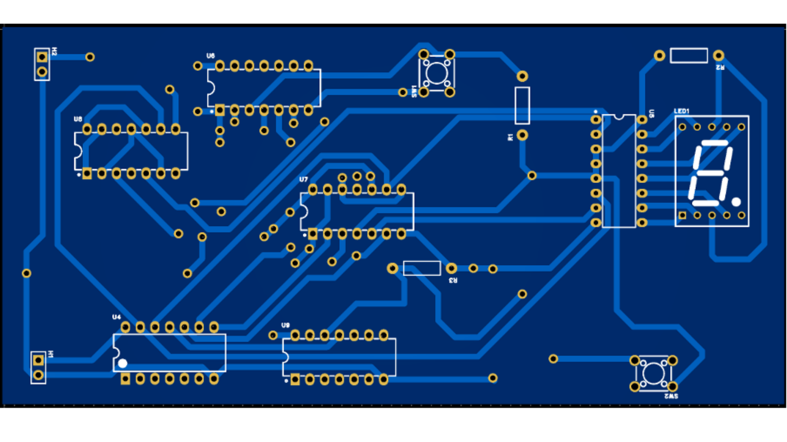
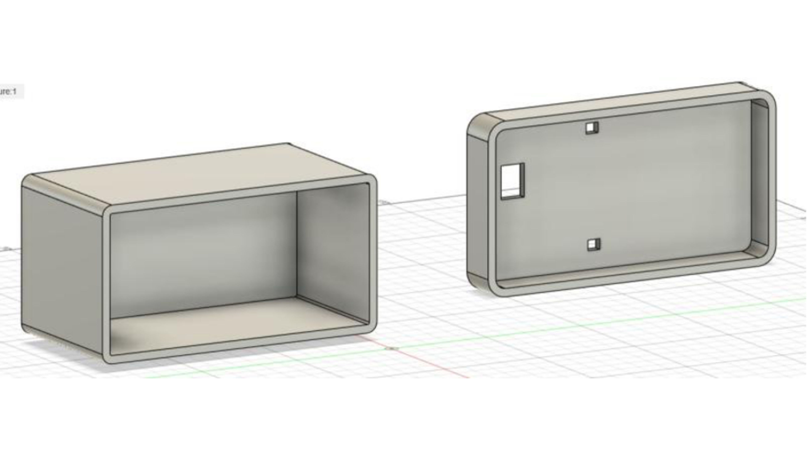

                                ###    IE2044 – System Modelling And Prototyping

### 1-Digit Decimal Up Counter (0–9) Using D Flip-Flops

By: IT23690370 – W A Elisha Y Perera | IT23736900 – M Nasif

### Project Overview

This project implements a 0–9 decimal up counter using D flip-flops in an asynchronous (ripple) configuration. The circuit includes automatic reset at count 9, manual reset, pause/resume control, and a 7-segment display.

### Project Photos  

### PCB Design  

### Key Features

Counter: 4-bit ripple counter using 74HC74 D flip-flops
Clock: NE555 timer (~1.5 Hz for visible counting)
Display: 7-segment (FJ5161BH) driven by SN74LS47 decoder
Controls: Manual reset button + Pause/Resume switch
Auto-Reset: Automatically resets at count 9 using NAND logic

### Files in This Repository

IE2044_Assignment_Group_6.docx – Full assignment report with diagrams and simulation results
media/ – Contains all circuit images, PCB layouts, and screenshots
  

### Tools Used

Simulation: Proteus 8 Professional
PCB Design: EasyEDA
Documentation: Microsoft Word

### Contact

GitHub: @mohomednasif614
